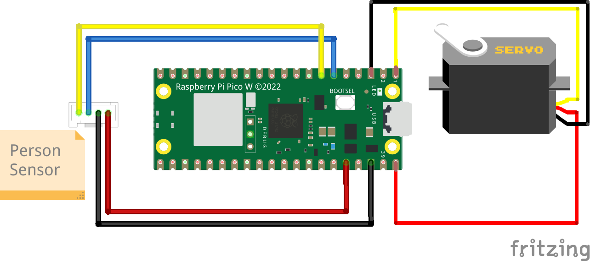
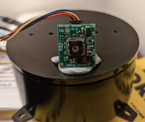

# Person Sensor Carousel
Orient a carousel to the nearest face using a Person Sensor.

## Introduction

The [Person Sensor](https://usfl.ink/ps) from [Useful Sensors](https://usefulsensors.com)
is a small, low-cost hardware module that detects nearby peoples’ faces, and
returns information about how many there are, where they are relative to the
device, and performs facial recognition. It is designed to be used as an input
to a larger system, and this example shows how to use it to control a
servo-driven carousel so that it always points towards the nearest face.

## BoM

To build this project you'll need:

 - [Raspberry Pi Pico H](https://www.adafruit.com/product/5056).
 - [Person Sensor from Useful Sensors](https://usfl.ink/ps).
 - [Qwiic connector cable with female jumpers](https://www.sparkfun.com/products/17261).
 - [LynxMotion Base Rotate Kit](https://www.robotshop.com/en/lynxmotion-base-rotate-kit-no-servo.html).
 - [Hitec HS-422 Servo Motor](https://www.robotshop.com/en/hitec-hs-422-servo-motor.html).
 - [3 Male to female jumper wires](https://www.sparkfun.com/products/9385).
 - Small Phillips screwdriver.
 - Blu Tack or something similar to hold the sensor in place.

No soldering is required. You should be able to use any servo and housing as
alternatives to the exact models listed here, these were just chosen because
they are easy to assemble. You can also use a regular Pico and solder on the
headers yourself if you don't have a Pico H.

## Assembling

### Carousel

- Unscrew the default horn from the servo if one is attached.
- Screw the servo into the carousel base.
- Place the ball bearing into the depressions in the top of the base.
- Connect the rotating plate onto the servo shaft, and screw it in.
- Plug the three M/F jumper wires into the servo cable.
- Wire them into the right pins on the Pico:
    - Black (GND) should go to pin 3.
    - Red (5V) should go to pin 40.
    - Yellow (DATA) should go to pin 1.

A full wiring diagram is included below.

### Person Sensor

Wiring up the sensor requires 4 jumpers, to connect VDD, GND, SDA and SCL. We're
using I2C port 0, which on the Pico is assigned to GPIO4 (SDA, pin 6) and GPIO5
(SCL, pin 7) in software. Power is supplied from 3V3(OUT) (pin 36), with ground
attached to GND (pin 38). If you're using [Qwiic connectors](https://www.sparkfun.com/qwiic),
the colors  will be black for GND, red for 3.3V, blue for SDA, and yellow for
SDC. It's the same setup as the [introductory CircuitPython sample code](https://github.com/usefulsensors/person_sensor_circuit_python).

### Wiring

### Mounting

The Person Sensor needs to be mounted on the plate of the carousel. If you're
actually skilled you can probably do something fancy like 3D printing a part,
but since I'm just a simple CEO I resorted to Blu Tack. It doesn't matter where
on the plate the sensor is mounted as long as it is facing outward, the
connector is on the top, and its view won't be blocked by anything you place on
the carousel.

## Setting up Circuit Python

You should read the [official guide to setting up CircuitPython on a Pico](https://learn.adafruit.com/getting-started-with-raspberry-pi-pico-circuitpython)
for the latest information, but here is a summary:

 - Download CircuitPython for your board from circuitpython.org. The Pico
 version is available at https://circuitpython.org/board/raspberry_pi_pico/.
 This project has been tested using the `8.0.0-beta.2` version.
 - Hold down the `bootsel` button on the Pico and plug it into a USB port.
 - Drag the CircuitPython uf2 file onto the `RPI-RP2` drive that appears.

Once you've followed those steps, you should see a new `CIRCUITPY` drive appear.
You can now drag `code.py` files onto that drive and the Pico should run them.

## Install Libraries

We need the [adafruit_motor library](https://docs.circuitpython.org/projects/motor/en/latest/)
to control the servo for the carousel, so the first step is to download a big
bundle of all the CircuitPython libraries from [circuitpython.org/libraries](https://circuitpython.org/libraries).
You'll need to find the right bundle for your CircuitPython version.

Once you have that downloaded, unpack the bundle on your local machine. In the
file viewer, go to the `lib` folder within the unpacked bundle and copy the
`adafruit_motor` directory into the `lib` folder on the `CIRCUITPYTHON` drive.
This should install the library we need to emulate a keyboard.

## Install the Code

Now your carousel is set up, copy the `code.py` file from this repository into
the `CIRCUITPYTHON` drive. You should notice that the green LED on the Person
Sensor lights up when it sees your face, and the carousel rotates until it is
facing towards you.

## Next Steps

The algorithm that controls the servo and moves it towards the nearest face is
quite simple, and could be improved if you want smoother animation. Right now it
only updates the position about five times a second, the same rate as the sensor
updates, but you could use much smaller timesteps for the movement to get less
jerky rotation. You could also add in some smoothing to give ease in and out to
make it less robotic.

You can also find out more about the Person Sensor from our [full developer guide](https://usfl.ink/ps_dev).
We're looking forward to seeing what the creative minds of the maker community
come up with, so please let us know how you get on!